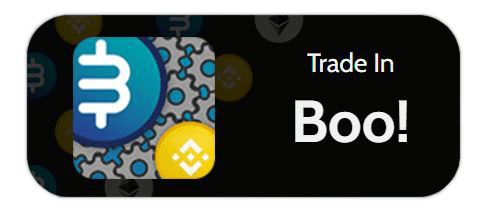

<!-- PROJECT SHIELDS -->
<!--
*** I'm using markdown "reference style" links for readability.
*** Reference links are enclosed in brackets [ ] instead of parentheses ( ).
*** See the bottom of this document for the declaration of the reference variables
*** for contributors-url, forks-url, etc. This is an optional, concise syntax you may use.
*** https://www.markdownguide.org/basic-syntax/#reference-style-links
-->

<!-- PROJECT LOGO -->

  

  <h1 style="font-weight:bold" align="center">Boo! Widgets</h1>

  

    Javascript library for embedding "Trade in Boo" Widgets on your website
  
  

 
 

  

## Information

This repository contains Javascript library in purpose to embed "Trade in Boo!" widgets easily in specific website served via <a href="https://jsdelivr.com">jsDelivr</a>.

## How to use?

This assets repository accommodates basic information tokens and logos that consumed directly by Boo! apps,
via <a href="https://jsdelivr.com">jsDelivr</a>.

<!-- LICENSE -->
## License

Distributed under the MIT License. See `LICENSE` for more information.

<!-- MARKDOWN LINKS & IMAGES -->
<!-- https://www.markdownguide.org/basic-syntax/#reference-style-links -->
<!-- [contributors-shield]: https://img.shields.io/github/contributors/github_username/repo.svg?style=for-the-badge -->
[contributors-url]: https://github.com/bumoonio/bumoon/graphs/contributors
<!-- [forks-shield]: https://img.shields.io/github/forks/github_username/repo.svg?style=for-the-badge
[forks-url]: https://github.com/github_username/repo/network/members
[stars-shield]: https://img.shields.io/github/stars/github_username/repo.svg?style=for-the-badge
[stars-url]: https://github.com/github_username/repo/stargazers
[issues-shield]: https://img.shields.io/github/issues/github_username/repo.svg?style=for-the-badge
[issues-url]: https://github.com/github_username/repo/issues
[license-shield]: https://img.shields.io/github/license/github_username/repo.svg?style=for-the-badge
[license-url]: https://github.com/github_username/repo/blob/master/LICENSE.txt
[linkedin-shield]: https://img.shields.io/badge/-LinkedIn-black.svg?style=for-the-badge&logo=linkedin&colorB=555 -->
[linkedin-url]: https://www.linkedin.com/company/bumoon/mycompany/
